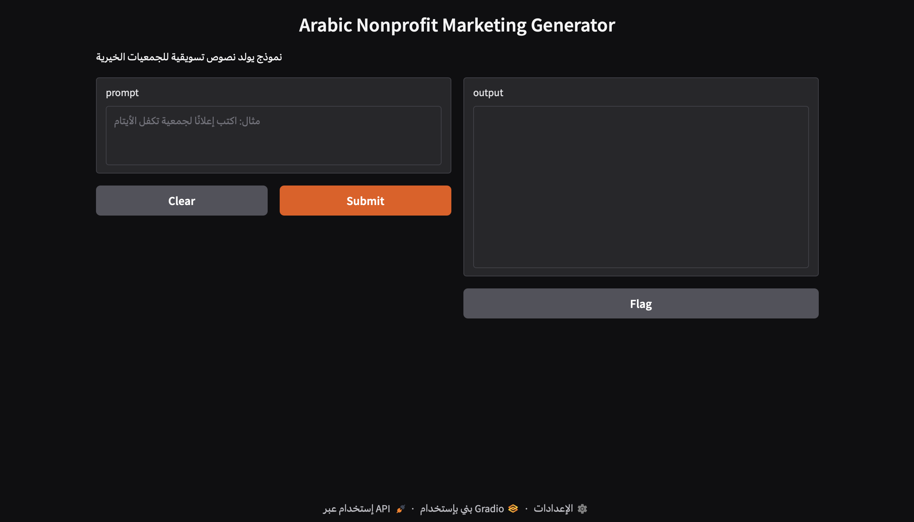

# Arabic Nonprofit Marketing GPT

## Project Description

Arabic Nonprofit Marketing GPT is an AI-powered language model designed to assist nonprofit organizations in generating impactful marketing and fundraising content in Arabic.

Nonprofit organizations often struggle with creating engaging campaign messages and awareness content. This project aims to support nonprofit marketers by providing an intelligent text generation tool that can produce campaign ideas, fundraising messages, and awareness content quickly and efficiently.

The system uses a custom dataset of nonprofit marketing examples and a trained language model to generate relevant Arabic marketing text.

---

## Project Objectives

The main objectives of this project are:

- Develop an AI system that generates Arabic nonprofit marketing content
- Assist nonprofit organizations in creating fundraising campaigns
- Provide an easy-to-use interface for testing the model
- Demonstrate how language models can support social impact initiatives

---

## Demo Interface

Below is the user interface used to test the model.

The interface allows users to enter a marketing prompt, and the model generates a corresponding nonprofit campaign message.

---

## Features

- Generate Arabic nonprofit marketing messages
- Assist with fundraising campaign content
- Support awareness campaigns
- Simple and interactive user interface
- AI-powered text generation

---

## Technologies Used

The project was developed using the following technologies:

- Python
- PyTorch
- NumPy
- Gradio
- HuggingFace Tokenizers

These tools were used for dataset processing, model training, and building the interactive interface.

---

## Dataset

A custom dataset was created for this project containing examples of nonprofit marketing messages and fundraising campaign content.

Dataset file:

nonprofit_marketing_dataset_clean_200.jsonl

The dataset was cleaned and formatted to be suitable for training a language generation model.

---

## Model Training

The model was trained using PyTorch with a dataset of nonprofit marketing examples.

Training steps included:

1. Data preprocessing and cleaning
2. Tokenization of Arabic text
3. Model training using PyTorch
4. Testing the generated outputs

The training process is documented in the notebook:

gpt_training_final.ipynb

---

## Project Structure

The repository includes the following files:

README.md  
Project documentation

demo.png  
Screenshot of the user interface

gpt_training_final.ipynb  
Notebook used for model training

nonprofit_marketing_dataset_clean_200.jsonl  
Dataset used to train the model

requirements.txt  
Required Python libraries

---

## How to Run the Project

1. Install the required libraries

pip install -r requirements.txt

2. Open the training notebook

gpt_training_final.ipynb

3. Run the notebook cells to train the model and launch the interface.

---

## Conclusion

This project demonstrates how AI language models can support nonprofit organizations by helping them generate effective marketing and fundraising content in Arabic. The system provides a simple interface and shows the potential of AI for social impact applications.

## Example Outputs

Example prompt:

اكتب إعلانًا لجمعية تكفل الأيتام

Example generated text:

كن سببًا في تغيير حياة طفل يتيم.  
بمساهمتك اليوم، يمكننا توفير التعليم والرعاية والدعم الذي يستحقه كل طفل.  
ساهم الآن واصنع أثرًا حقيقيًا.

---

## Model Architecture

The system is based on a simplified GPT-style transformer architecture implemented using PyTorch.  
The model uses token embeddings, transformer blocks, and a language modeling head to generate Arabic text based on input prompts.

---

## Future Work

Possible improvements for this project include:

- Expanding the dataset with more nonprofit marketing examples
- Training a larger model for better text quality
- Improving text coherence and reducing repetition
- Deploying the model as an online service for nonprofit organizations
